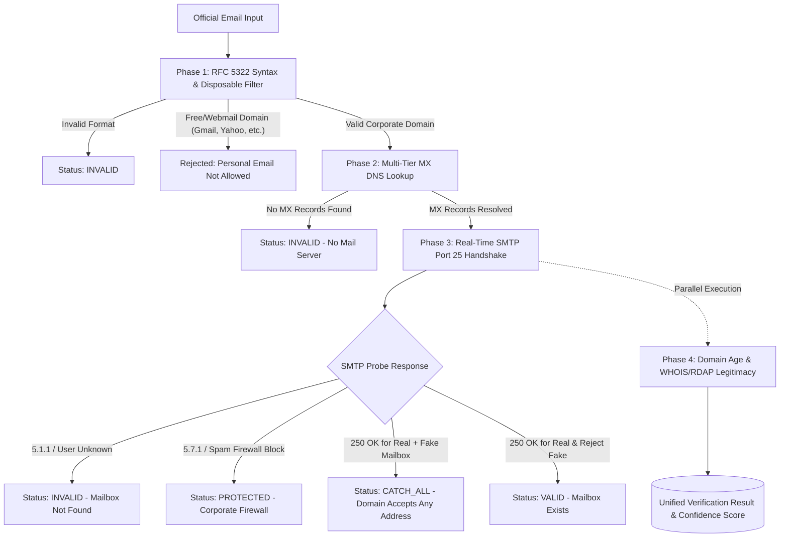

# ⚡ Corporate Email Verification API & Microservice

A high-performance, enterprise-grade standalone Email Verification REST API and microservice engine designed to verify corporate/official work emails across all your client projects.

---

## 🏗️ Architecture & Verification Flow



---

## 📊 Verification Status Matrix

| Status | Meaning | Action / Interpretation |
| :--- | :--- | :--- |
| **`VALID`** | Mailbox confirmed active via low-level SMTP handshake and random probe rejection. | High confidence; official corporate mailbox exists and accepts mail. |
| **`CATCH_ALL`** | Mail server accepts all recipient addresses on the domain. | Domain and mail server are active, but mailbox existence cannot be strictly isolated via SMTP. |
| **`PROTECTED`** | Corporate firewall / Anti-Spam gateway blocked direct probing (e.g., M365, Proofpoint, Cisco IronPort). | Normal for high-security enterprise domains. Mail server is active and protected. |
| **`INVALID`** | Bad RFC syntax, free webmail/disposable domain, missing MX records, or server returned `5.1.1` (User Not Found). | Fake, personal, or expired email address. |

---

## 🚀 Getting Started

### 1. Installation
```bash
cd EmailVerificationApi
npm install
```

### 2. Configuration (`.env`)
```env
PORT=3000
HOST=0.0.0.0
NODE_ENV=development

# Optional API Key to secure your endpoints
API_KEY=

# SMTP Handshake configuration
SMTP_HELO_DOMAIN=mail.validator.local
SMTP_MAIL_FROM=verify@validator.local
SMTP_TIMEOUT_MS=7000
SMTP_PORT=25

# DNS Timeout
DNS_TIMEOUT_MS=3500
```

### 3. Start Development Server
```bash
npm run dev
```

### 4. Build and Run Production
```bash
npm run build
npm start
```

### 5. Interactive Web Dashboard & Tester
Open [http://localhost:3000](http://localhost:3000) in your browser for a live UI to test single emails, batch lists, and domain age queries.

---

## 📡 API Endpoints Reference

### 1. Single Email Verification
`POST /api/verify` (Alias: `POST /api/verify-corporate-email`)

#### Request Body
```json
{
  "email": "employee@microsoft.com",
  "applicantId": "USR_12345",
  "leadId": "LEAD_98765",
  "options": {
    "allowFreeDomains": false,
    "checkSmtp": true,
    "checkDomainAge": true,
    "smtpTimeoutMs": 7000
  }
}
```

#### Response (`200 OK`)
```json
{
  "success": true,
  "data": {
    "applicantId": "USR_12345",
    "leadId": "LEAD_98765",
    "email": "employee@microsoft.com",
    "status": "PROTECTED",
    "reason": "Enterprise spam firewall / security gateway protected (e.g. M365, Proofpoint, Cisco).",
    "score": 85,
    "isDeliverable": true,
    "isCorporate": true,
    "isCatchAll": false,
    "isProtected": true,
    "details": {
      "syntax": {
        "isValid": true,
        "isBannedFreeDomain": false,
        "isDisposableDomain": false,
        "cleanEmail": "employee@microsoft.com",
        "user": "employee",
        "domain": "microsoft.com"
      },
      "dns": {
        "hasMxRecords": true,
        "mxRecords": [
          { "exchange": "microsoft-com.mail.protection.outlook.com", "priority": 10 }
        ],
        "primaryMx": "microsoft-com.mail.protection.outlook.com",
        "resolutionSource": "NATIVE_DNS"
      },
      "smtp": {
        "status": "PROTECTED",
        "mailboxExists": false,
        "isCatchAll": false,
        "isProtected": true,
        "connectedHost": "microsoft-com.mail.protection.outlook.com",
        "handshakeSuccess": true
      },
      "domainAge": {
        "domain": "microsoft.com",
        "creationDate": "1991-05-02",
        "ageDays": 12929,
        "ageYears": 35.4,
        "registrar": "MarkMonitor Inc.",
        "isNewDomain": false,
        "source": "RDAP"
      }
    },
    "durationMs": 1596,
    "verifiedAt": "2026-09-24T04:56:56.031Z"
  }
}
```

---

### 2. Batch Email Verification
`POST /api/verify/batch`

#### Request Body
```json
{
  "emails": [
    "contact@stripe.com",
    "hr@microsoft.com",
    "user@gmail.com"
  ],
  "concurrency": 5,
  "options": {
    "allowFreeDomains": false
  }
}
```

#### Response (`200 OK`)
```json
{
  "success": true,
  "data": {
    "total": 3,
    "validCount": 0,
    "invalidCount": 1,
    "catchAllCount": 1,
    "protectedCount": 1,
    "durationMs": 3312,
    "results": [ ... ]
  }
}
```

---

### 3. Domain Age & Corporate Legitimacy
`POST /api/domain-age` (Alias: `POST /dosvak/domain-age`)

#### Request Body
```json
{
  "domain": "stripe.com"
}
```

#### Response (`200 OK`)
```json
{
  "success": true,
  "data": {
    "domain": "stripe.com",
    "creation_date": "1995-09-12",
    "age_years": 31.03,
    "age_days": 11335,
    "is_new_domain": false,
    "registrar": "MarkMonitor Inc.",
    "status": ["clientTransferProhibited"],
    "source": "RDAP"
  }
}
```

---

### 4. Health Check
`GET /api/health`

```json
{
  "status": "healthy",
  "service": "Email Verification API",
  "uptimeSeconds": 120,
  "timestamp": "2026-09-24T05:00:00.000Z",
  "nodeVersion": "v24.16.0",
  "memoryUsageMb": 65
}
```

---

## 🔌 Integration in Your 3-4 Projects

### Option A: Using the Reusable TypeScript / Node.js Client SDK
You can copy [`src/sdk/emailVerifierClient.ts`](file:///d:/EmailVerificationApi/src/sdk/emailVerifierClient.ts) directly into your projects:

```typescript
import { EmailVerifierClient } from './emailVerifierClient';

const verifier = new EmailVerifierClient({
  baseUrl: process.env.EMAIL_VERIFIER_URL || 'http://localhost:3000',
  apiKey: process.env.EMAIL_VERIFIER_API_KEY
});

// Single corporate email verification in your onboarding / lead flow
const result = await verifier.verifyEmail(userEmail, { applicantId: '123' });
if (result.data.status === 'VALID' || result.data.status === 'PROTECTED' || result.data.status === 'CATCH_ALL') {
  // Allow proceeding
} else {
  // Reject: invalid or personal email
  throw new Error(result.data.reason);
}
```

### Option B: Direct HTTP Call (Axios / Fetch)
```javascript
const axios = require('axios');

async function checkOfficialEmail(email) {
  const resp = await axios.post('http://localhost:3000/api/verify', {
    email,
    options: { allowFreeDomains: false }
  });
  return resp.data.data;
}
```

### Option C: Python (Requests)
```python
import requests

def verify_email(email):
    res = requests.post("http://localhost:3000/api/verify", json={
        "email": email,
        "options": {"allowFreeDomains": False}
    })
    return res.json()["data"]
```

---

## 🧪 Testing

Run the automated test suite covering all 5 phases:
```bash
npm test
```
